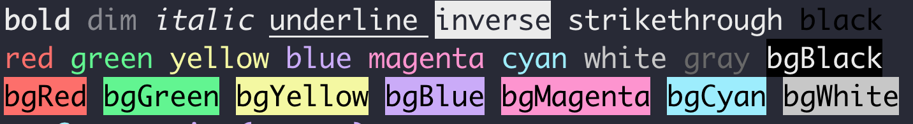

# Crayon

<a href="https://travis-ci.org/jianstm/Crayon">
  
</a>
<br>
<div align="center">
    
    <br>
    <br>
    <br>
    <strong>Expressive styling on terminal string.</strong>
</div>

## Highlights

- Expressive API
- 256/TrueColor support
- Style nestable
- Auto downgrading to terminal color level
- No extensions on `String`
- Built-in 100+ handpicked colors
- rgb & hsl & hsv & hex

## Usage

```swift
print(crayon.cyan.on("cyan"))  // cy is an alias to crayon

print(cy.red.bgBlue.on("red bgBlue"))

print(cy.red.bgMagenta.bold.underline.on("red bgMagenta bild underline"))

print(cy.fg(.coral).bg(.lightGreen).bold.on("coral lightGreen bold"))

print(cy.fg(.rgb(0, 92, 197)).bg(.hex(0xf6f8fa)).bold.on("hello"))

print(cy.bgYellow.on("begin" + cy.red.bold.on("important") + "end"))


let warn = { (s: String) in
	return cy.white.bgYellow.on(s)
}
let error = { (s: String) in
	return cy.red.bold.on(s)
}
print(warn("this is a warning!"))
print(error("something wrong!")
```

## Styles

### Modifiers

```swift
reset
bold
faint              // aka dim, not widely supported.
italic
underline
blink
reverse = 7
conceal            // aka hidden, not widely supported.
crossedOut         // aka strikethrough, not widely supported.
```

### Colors

#### Ansi16

```swift
black
red
green
yellow
blue
magenta
cyan
white

blackBright
redBright
greenBright
yellowBright
blueBright
magentaBright
cyanBright
whiteBright
```

#### 256/TrueColoe

```swift
cy.fg(.rgb(0, 100, 200))
cy.fg(.hsl(300, 50, 50))
cy.fg(.hsv(300, 50, 50))
cy.bg(.hex(0x123456))
cy.bg(.hex("#abc")
cy.bg(.hex("#123456")
```

## Install

```swift
dependencies: [
    .package(url: "https://github.com/jianstm/Crayon", .upToNextMajor(from: "0.0.1"))
]
```

## Contribute

If you want to add new features, feel free to submit a pull request. Any contributing is welcome at all times!

## Acknowledge

Inspired by the awesome javascript library [chalk](https://github.com/chalk/chalk).
